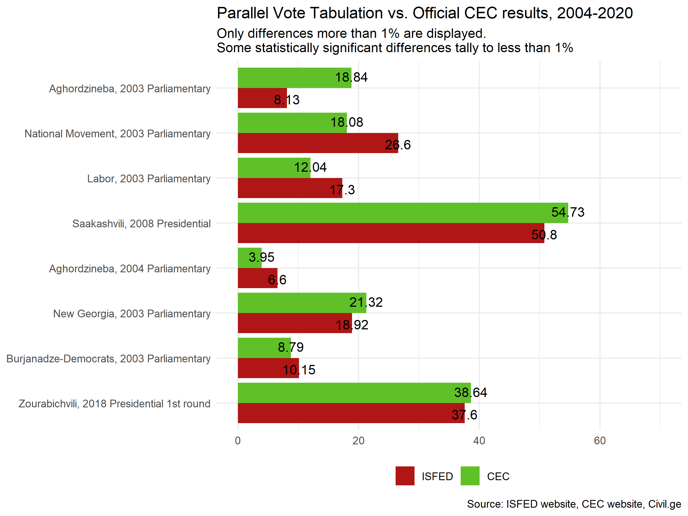

### Parallel vote tabulation results for elections in the Republic of Georgia, 2003-2020

* PVT.xlsx - raw data sourced from civil.ge, the CEC website, Wikipedia (election results for 2003-2004), and the website of the International Society For Free Elections and Democracy (ISFED).
* analysis.R - generates chart below:

This dataset contains available data on parallel vote tabulation conducted by the International Society For Free Elections and Democracy (ISFED) in Georgia. In several cases data on error margins was not included in the analyzed sources.